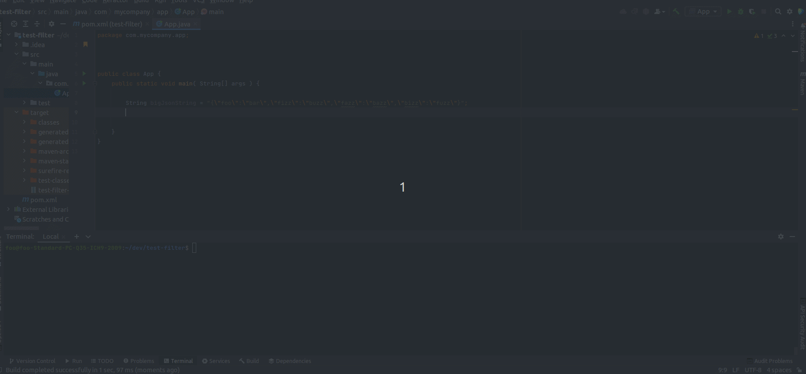

## JSON string Converter.



### To build:
Clone the project if you haven't done so:
```shell
git clone https://github.com/marcelus20/json-string-converter
```
Then build using the mvn command:
```shell
mvn clean install
```

### Usage:
##### Use case 1: 
Convert a bigger json string into a smaller json string. The smaller json will contain the keys passed in the function argument. 
PS: Any key argument passed that doesn't exist in the json string will make the function return an empty json string ("{}"). 
```java
package com.mycompany.app;

import org.marcelus.json.string.utils.filters.JsonFilterer;

public class App {
    public static void main( String[] args ) {

        String bigJsonString = "{\"foo\":\"bar\",\"fizz\":\"buzz\",\"fazz\":\"bazz\",\"bizz\":\"fuzz\"}";

        String filteredJson = JsonFilterer.filter(bigJsonString, "foo", "bizz");

        // filteredJson will be {"foo":"bar","bizz":"fuzz"}

    }
}
```

---
#### Use Case 2
Convert a bigger json into a smaller json, but enforcing the smaller json string to follow a class Schema. 

In this use case, the filter method will keep the json keys that have the same name as the **class fields**.

PS: The class field names **must** be identical to the json keys. It is case sensitive! 
```java
package com.mycompany.app;

import lombok.AllArgsConstructor;
import lombok.Data;
import lombok.NoArgsConstructor;
import org.marcelus.json.string.utils.filters.JsonFilterer;


public class App {


    @Data
    @NoArgsConstructor
    @AllArgsConstructor
    public static class FooFizz{
        private String foo;
        private String bizz;

    }
    public static void main( String[] args ) {

        String bigJsonString = "{\"foo\":\"bar\",\"fizz\":\"buzz\",\"fazz\":\"bazz\",\"bizz\":\"fuzz\"}";

        String filteredJson = JsonFilterer.filter(bigJsonString, App.FooFizz.class);

        // filteredJson will be {"foo":"bar","bizz":"fuzz"}

    }
}
```

## Contributing
Pull requests are welcome. For major changes, please open an issue first to discuss what you would like to change.

Please make sure to update tests as appropriate.

## License
[MIT](https://choosealicense.com/licenses/mit/)
